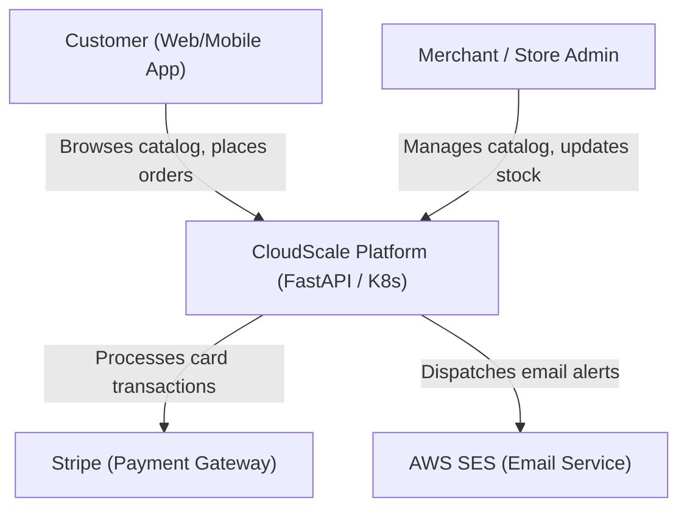
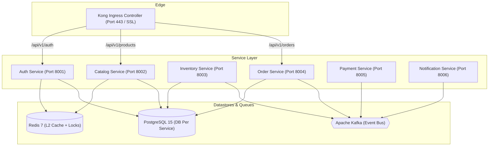
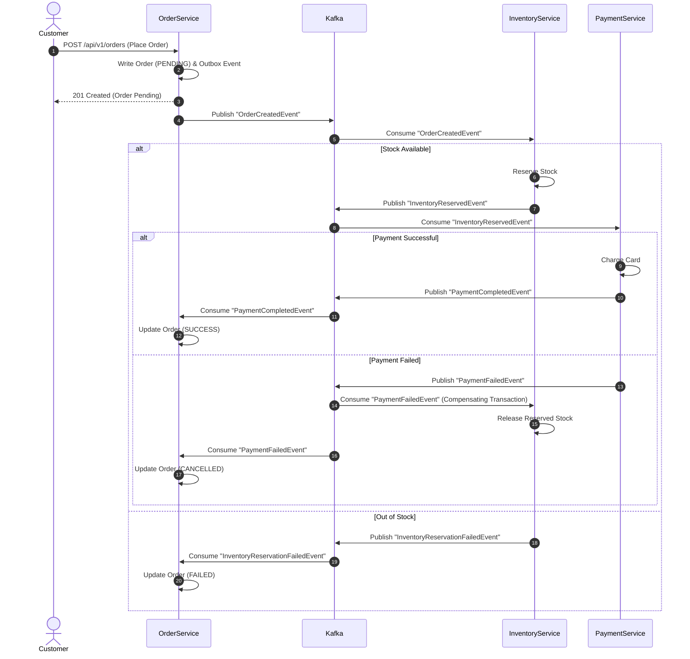
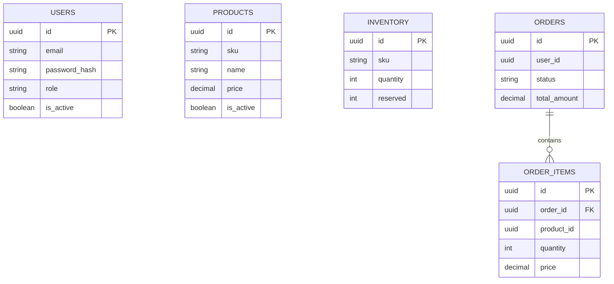

# CloudScale Commerce — System Architecture & C4 Model Diagrams

This document contains Mermaid diagrams visualizing the platform's distributed container topology, checkout saga state machines, and relational schemas.

---

## 1. C4 Context Diagram
The high-level boundary of the e-commerce system, its actors, and external system integrations.

---

## 2. C4 Container Diagram
Details the microservice boundaries, databases, caches, and communication protocols.

---

## 3. Sequence Diagram — Order Checkout Saga Flow
Detailed message sequence demonstrating the choreographed Saga pattern coordinating transactions across services.

---

## 4. Database ER Schema (Shared Topologies)
Entities and relationships mapped within each database schema boundaries.

