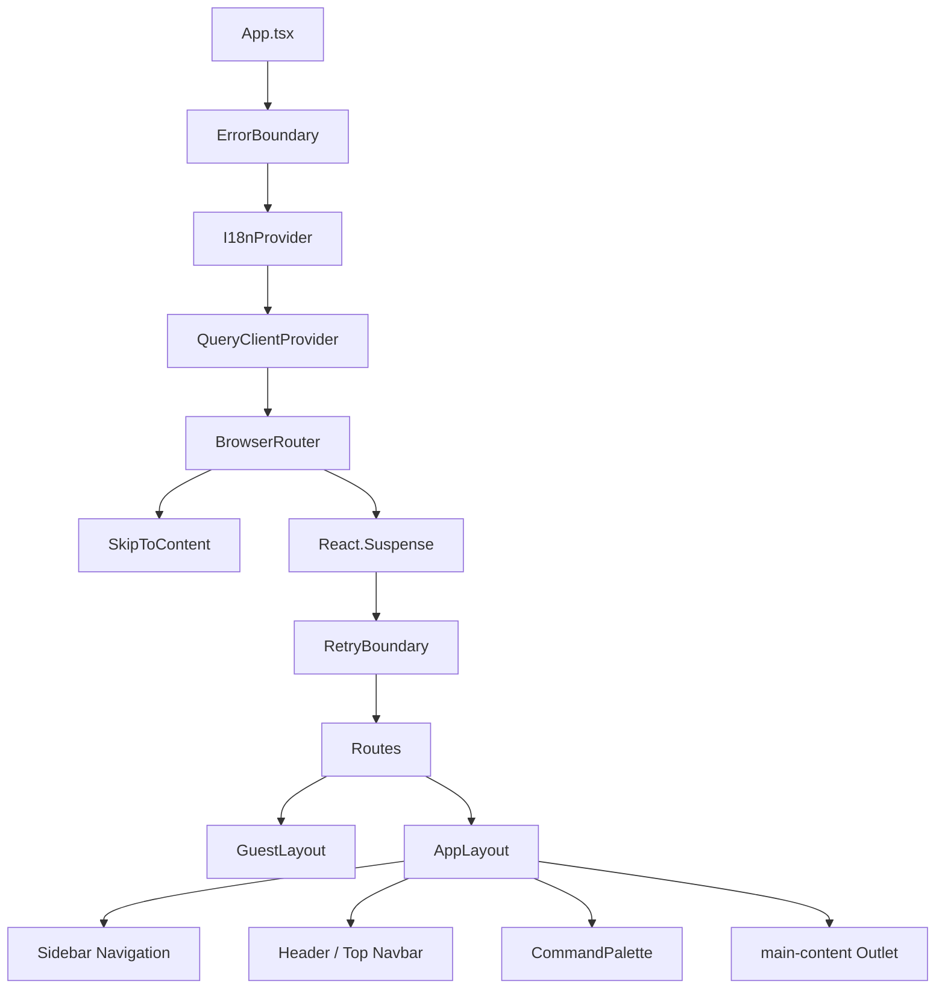

# Frontend Architecture & State Management Documentation

This document outlines the high-level architecture, component hierarchy, and state management patterns of **CloudScale Commerce**'s React 19 + TypeScript frontend.

---

## 1. Directory Structure & Architecture

The project follows a **Feature-first Clean Architecture** layout:

```
src/
├── components/          # Shared components (Layouts, UI Primitives, Data Tables)
│   ├── data/            # Table rendering, virtualized datatable elements
│   ├── ui/              # Atom/Design System primitives (Button, Badge, Accordion)
│   └── ErrorBoundary    # Global error handlers
├── hooks/               # Custom reusable React hooks (Autosave, Focus Trap, Shortcuts)
├── i18n/                # Internationalization configs (EN, ES translation files)
├── layouts/             # Grid structures (AppLayout, GuestLayout wrappers)
├── lib/                 # Core utilities (observability, API Client, security wrappers)
├── pages/               # Page components lazily loaded via React.lazy
├── stores/              # Zustand state managers (Cart, Theme, Search, Notifications)
└── test/                # Test utilities and unit test suites
```

---

## 2. Component Hierarchy

The entry point resolves routes using **React Router v7** wrapped in global context providers:



---

## 3. State Management Strategy

We combine **Zustand** (for client-side UI, persistent cart, notifications, and search history) with **TanStack Query** (for server-side data fetching and synchronization caching):

```
                       ┌─────────────────────────┐
                       │      React UI Page      │
                       └────┬───────────────▲────┘
                            │               │
      Read/Write Client State│               │ Read Server-side Cached Data
                            ▼               │
               ┌────────────────────────┐   │
               │   Zustand Stores       │   │
               │ (Cart, Search, Theme)  │   │
               └────────────────────────┘   │
                                            │
                            ┌───────────────┴────┐
                            │   TanStack Query   │
                            │  (Server State)    │
                            └───────┬───────▲────┘
                                    │       │
                                API │       │ Cache Refresh
                                    ▼       │
                       ┌─────────────────────────┐
                       │     Axios API Client    │
                       └─────────────────────────┘
```

### Store Reference Listing:
- **`useCartStore`**: Manages persistent cart lines, quantities, coupons, and automatic tax calculation.
- **`useNotificationStore`**: Listens to WS notifications, applies category preferences, and issues Toast indicators.
- **`useSearchStore`**: Records recent query inputs with clear triggers.
- **`useThemeStore`**: Toggles dark mode.
