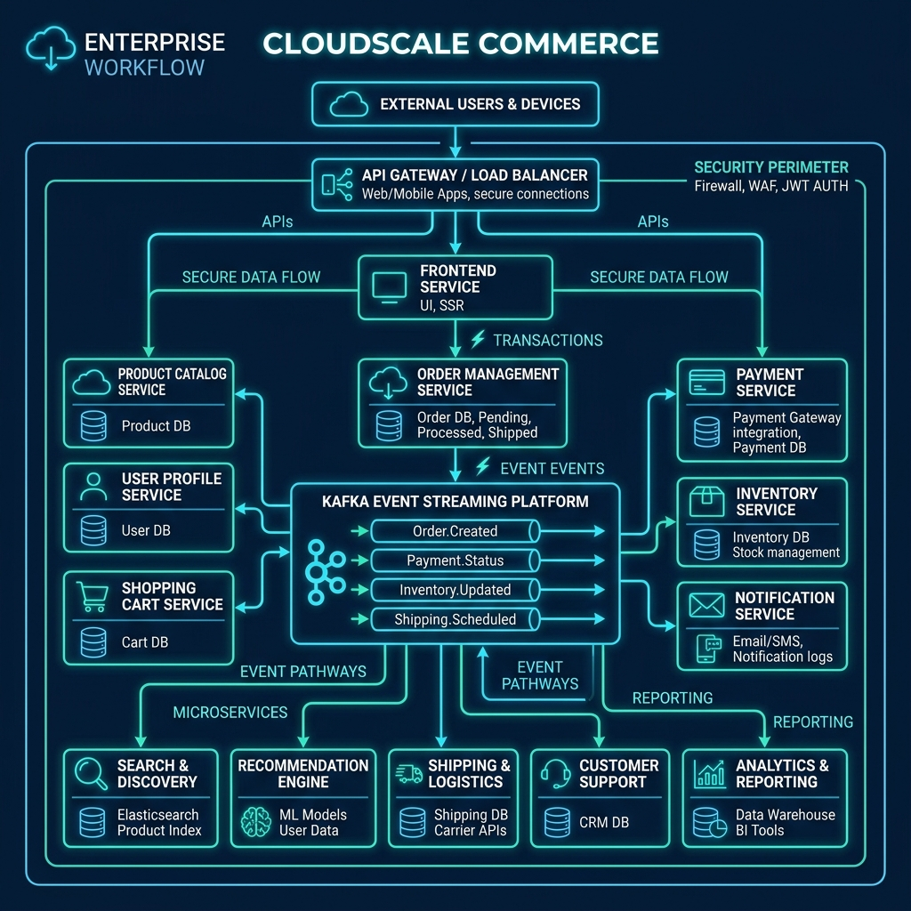
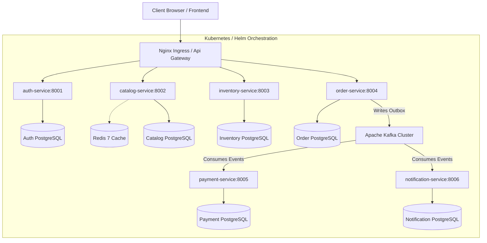

# CloudScale Commerce

<p align="center">
  
</p>

[](file:///.github/workflows/pr-validation.yml)
[](file:///.github/workflows/security-devsecops.yml)
[](file:///LICENSE)

An enterprise-grade, multi-tenant, event-driven e-commerce microservices platform built with **Python 3.12 (FastAPI)**, **PostgreSQL**, **Apache Kafka**, **Redis**, and **Kubernetes**. 

This repository implements production-grade distributed systems patterns designed to solve data consistency, race conditions, tenant isolation, and security at scale.

---

## Architecture Overview



### Microservices Catalog
1. **[Auth Service](file:///services/auth)**: Handles user registration, Argon2id password hashing, JWT token rotation, and Role-Based Access Control (RBAC).
2. **[Catalog Service](file:///services/catalog)**: Manages product inventories and handles semantic product searches using a custom tf-idf vector search index.
3. **[Inventory Service](file:///services/inventory)**: Controls product stocks, manages reservations, and enforces concurrency limits.
4. **[Order Service](file:///services/order)**: Acts as the checkout Saga coordinator, directing multi-stage transactional checkout states.
5. **[Payment Service](file:///services/payment)**: Implements dual-path simulated/real payments behind a strict `SIMULATE_PAYMENTS` flag.
6. **[Notification Service](file:///services/notification)**: Dispatches transactional order updates (currently simulated for local/staging deployments).

---

## Architectural & Distributed Systems Patterns

### 1. Transactional Outbox & Inbox Patterns
To avoid dual-write failures (e.g., updating a database but failing to notify Kafka), services implement the **Transactional Outbox Pattern**:
* **Outbox Publish**: Domain state updates and outbound event creation are written to the database within a single local ACID transaction using [write_outbox()](file:///shared/python/cloudscale_shared/outbox.py#L47-L60).
* **Outbox Worker**: An asynchronous background loop [OutboxWorker](file:///shared/python/cloudscale_shared/outbox.py#L63-L80) polls the outbox table, publishes events to Kafka with at-least-once delivery guarantees, and marks them processed.
* **Inbox Deduplication**: Consumers leverage [inbox_already_processed()](file:///shared/python/cloudscale_shared/inbox.py#L36-L50) to prevent duplicate processing (exactly-once processing semantics at the application boundary).

### 2. Sagas (Choreographed Saga State Machine)
The checkout pipeline coordinates distributed transactions across Order, Inventory, and Payment services using a reactive state machine:
```
  [Order PENDING] ──► (InventoryReservedEvent) ──► [STOCK_RESERVED]
  [STOCK_RESERVED] ──► (PaymentSuccessEvent) ──► [CONFIRMED]
  
  %% Compensation flows
  [PENDING] ──► (InventoryReserveFailedEvent) ──► [CANCELLED_NO_STOCK]
  [STOCK_RESERVED] ──► (PaymentFailedEvent) ──► [CANCELLED] ──► Trigger Stock Release
```

### 3. PostgreSQL Row-Level Security (RLS)
Tenant-level data isolation is enforced at the database driver boundary using native PostgreSQL policies:
* Multi-tenant tables are secured via [v2_postgresql_rls_migration.py](file:///shared/python/cloudscale_shared/v2_postgresql_rls_migration.py).
* SQLAlchemy sessions set connection-level context (`app.current_tenant_id`) during instantiation.
* PostgreSQL rejects queries seeking data outside of the transaction-scoped tenant ID, providing robust mitigation against tenant data leakage.

### 4. Optimistic Concurrency Control (OCC)
In high-concurrency settings (such as flash sales), the [Inventory](file:///services/inventory/app/models.py) model implements version-based optimistic locking (`version_id_col`) to prevent double-allocations and race conditions without blocking database threads.

---

## Infrastructure & DevSecOps

### CI/CD Workflows
* **[Pull Request Validation](file:///.github/workflows/pr-validation.yml)**: Runs linting (Ruff, Black), strict type checks (Mypy), and parallel unit testing. Connects automatically to a real `postgres:15-alpine` container to ensure migration compatibility.
* **[DevSecOps Pipeline](file:///.github/workflows/security-devsecops.yml)**: Scans for vulnerabilities via Bandit (SAST) and Trivy (container image layers), produces SPDX SBOM files, and performs keyless image signing via **Cosign** (Fulcio/Rekor).
* **[Continuous Deployment](file:///.github/workflows/aws-eks-deployment.yml)**: Automates canary-based rollouts to AWS EKS with post-deployment functional smoke testing gates.

### Kubernetes Deployment
* **Helm v3 Charts**: The parent chart [cloudscale-parent](file:///deployments/helm/cloudscale-parent) configures microservices dynamically using structured profiles (`values-dev.yaml`, `values-staging.yaml`, `values-prod.yaml`).
* Features pre-configured horizontal pod autoscalers (HPAs), network policies, and pod disruption budgets.

---

## Setup & Execution

### 1. Local Run (Docker Compose)
Spins up PostgreSQL instances, Apache Kafka, Redis, and all microservices:
```bash
docker compose up -d --build
```

### 2. Run Test Suites
Ensure Python dependencies are locked (`requirements.lock` generated via `pip-compile`) and execute:
```bash
# Execute local service tests
PYTHONPATH=services/auth pytest services/auth/tests/

# Execute system-wide functional smoke tests
pytest tests/smoke/
```

### 3. Protobuf Contracts
Protocol Buffers are located in [shared/proto/](file:///shared/proto/). Compilation is performed via:
```bash
pip install grpcio-tools
python -m grpc_tools.protoc -Ishared/proto --python_out=shared/python/cloudscale_shared/grpc --grpc_python_out=shared/python/cloudscale_shared/grpc shared/proto/*.proto
```

---

## Software Engineering Guidelines & Compliance
* **Type Safety**: Enforced strict annotations across shared modules and services checked by Mypy.
* **Code Style**: Zero-warnings policy enforced via Ruff.
* **Change Log**: Follows Semantic Versioning rules tracked in the [CHANGELOG](file:///CHANGELOG.md).
