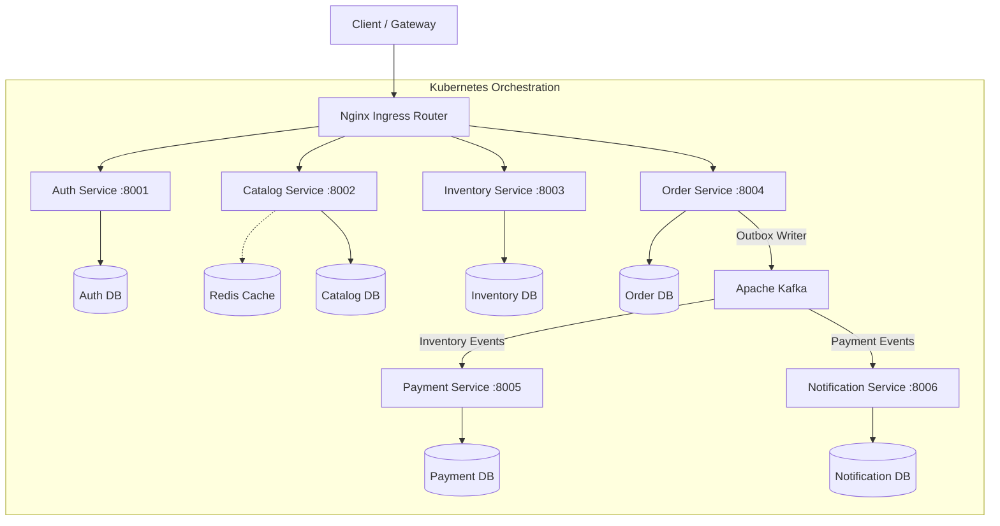

# CloudScale Commerce


CloudScale Commerce is an event-driven, multi-tenant e-commerce microservices platform built with **Python 3.12 (FastAPI)**, **PostgreSQL**, **Apache Kafka**, **Redis**, and **Kubernetes (Helm)**.

The project demonstrates distributed system design patterns including the Transactional Outbox/Inbox pattern, Choreographed Sagas for distributed checkouts, PostgreSQL Row-Level Security (RLS) for tenant isolation, and version-based Optimistic Concurrency Control.


## Architecture Overview



### Microservices Breakdown

| Service | Port | Description | Primary Tech Stack |
| :--- | :--- | :--- | :--- |
| **Auth Service** | `:8001` | Authentication, Argon2id hashing, JWT token generation, RBAC, and auth rate limiting | FastAPI, PostgreSQL, Redis |
| **Catalog Service** | `:8002` | Product listing, category management, Redis caching, and TF-IDF search | FastAPI, PostgreSQL, Redis |
| **Inventory Service** | `:8003` | Stock reservation and Optimistic Concurrency Control (OCC) | FastAPI, PostgreSQL, Redis |
| **Order Service** | `:8004` | Order processing, Saga coordination, Outbox writer, and stale saga timeout sweeper | FastAPI, PostgreSQL, Kafka |
| **Payment Service** | `:8005` | Event-driven mock payment processing (Stripe extension point) & outbox events | FastAPI, PostgreSQL, Kafka |
| **Notification Service** | `:8006` | Consumes payment/order events and dispatches notifications | FastAPI, SQLite/PostgreSQL, Kafka |

---

## Key System Architecture Patterns

### 1. Transactional Outbox & Inbox Pattern
Prevents dual-write inconsistencies between database transactions and event publishing:
* **Outbox**: Domain state changes and outbound Kafka events are committed in a single local ACID transaction via `write_outbox()`.
* **Outbox Worker**: Background `OutboxWorker` tasks poll outbox tables and publish events to Kafka with at-least-once delivery guarantees.
* **Inbox Deduplication**: Consumers verify `inbox_already_processed()` to enforce idempotent message handling at application boundaries.

### 2. Choreographed Saga Checkout
Coordinates checkout transactions across Order, Inventory, and Payment services:
```
  [Order PENDING] ──► (InventoryReservedEvent) ──► [STOCK_RESERVED]
  [STOCK_RESERVED] ──► (PaymentSuccessEvent) ──► [CONFIRMED]
  
  %% Compensation flows
  [PENDING] ──► (InventoryReserveFailedEvent) ──► [CANCELLED_NO_STOCK]
  [STOCK_RESERVED] ──► (PaymentFailedEvent) ──► [CANCELLED] ──► (Stock Released)
```
* **Saga Timeout Sweeper**: Periodic background task identifies expired pending orders (default 15 minutes) and dispatches cancellation compensation events.

### 3. Tenant Data Isolation (PostgreSQL RLS)
* Multi-tenant tables enforce `FORCE ROW LEVEL SECURITY`.
* Database sessions set `app.current_tenant_id` session context via SQL `set_config()` per transaction, restricting row visibility dynamically per tenant.

### 4. Optimistic Concurrency Control (OCC)
* Inventory stock updates leverage SQLAlchemy version columns (`version_id_col`) to detect concurrent stock allocation races and prevent double-selling under high concurrency.

---

## Repository Structure

```
cloudscale-commerce/
├── services/
│   ├── auth/            # Auth & JWT management
│   ├── catalog/         # Product catalog & search
│   ├── inventory/       # Stock tracking & OCC
│   ├── order/           # Order processing & Saga sweeper
│   ├── payment/         # Payment consumer & billing
│   └── notification/    # Event-driven notification dispatch
├── shared/python/       # Shared Python library (cloudscale_shared)
├── deployments/
│   ├── docker/          # Local Docker Compose setup
│   └── helm/            # Helm charts for Kubernetes deployments
├── tests/
│   ├── contract/        # API contract integration tests
│   └── smoke/           # End-to-end service smoke tests
├── Makefile             # Automation targets for setup, testing, and formatting
└── README.md
```

---

## Local Development & Setup

### Prerequisites
* Python 3.12+
* Docker & Docker Compose (optional for local infra)

### 1. Environment Setup
Create environment files or export default secrets:
```bash
cp services/auth/.env.example services/auth/.env
cp services/payment/.env.example services/payment/.env
```

### 2. Run Services via Docker Compose
To start PostgreSQL, Kafka, Redis, and all microservices:
```bash
docker compose -f deployments/docker/docker-compose.yml up -d --build
```

### 3. Running Unit & Service Tests
Install the shared library locally and run pytest:
```bash
# Install shared library in editable mode
pip install -e ./shared/python

# Run test suite across all services
make test

# Or run tests for a specific service
make test-auth
make test-order
```

---

## DevSecOps & Quality Assurance

* **Code Formatting & Linting**: Enforced with `ruff` and `black`.
* **Type Safety**: Checked across services using `mypy`.
* **SAST Scanning**: Static application security testing via `bandit`.
* **Container Vulnerability Scanning**: Vulnerability scanning of images using `trivy`.
* **Container Image Attestation**: Keyless image signing using Sigstore `cosign` and SPDX SBOM generation.

---

## License

Distributed under the MIT License. See [LICENSE](LICENSE) for details.
